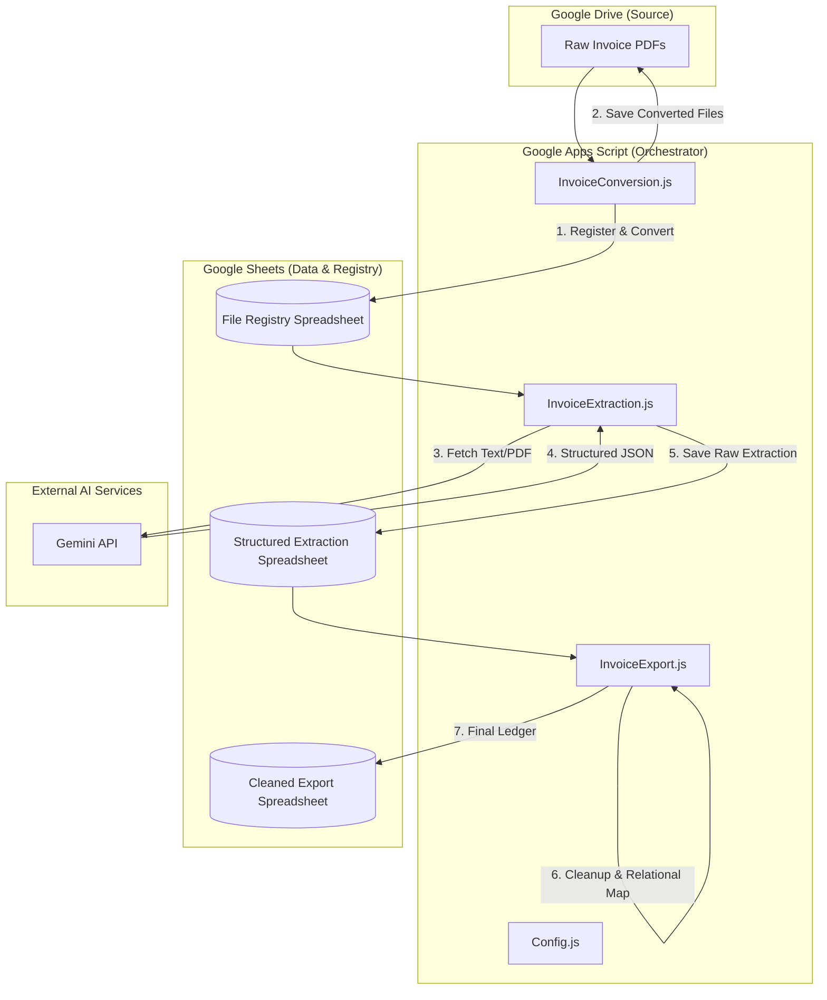

# Invoice Data Extraction Pipeline (V1)

This directory contains the first version (V1) of the AI-powered ETL (Extract, Transform, Load) pipeline for invoice data.

## Architecture Diagram

## Overview

The pipeline is built using Google Apps Script and leverages the Gemini API to extract structured data from invoice documents. It was designed to automate the process of converting raw invoice files into a structured format for further analysis and reporting.

## Project Structure

The project is organized into several JavaScript files, each handling a specific part of the ETL process:

- **`Config.js`**: Contains global constants, configuration settings, and retrieves secrets (like API keys and folder IDs) from ScriptProperties.
- **`InvoiceExtraction.js`**: The core logic for interacting with the Gemini API to extract structured data from converted invoice content.
- **`InvoiceConversion.js`**: Handles the conversion of source invoice files (e.g., PDFs) into other formats (Google Docs, HTML, PDF) to facilitate text extraction.
- **`InvoiceExport.js`**: Manages the export of extracted data to target spreadsheets or other destinations.
- **`WebExtraction.js`**: A utility for scraping the company website to build a product/service knowledge base, which can be used to improve extraction accuracy.
- **`Diagnostics.js`**: Contains utility functions for testing and debugging the pipeline.
- **`appsscript.json`**: The manifest file for the Google Apps Script project.

## Workflow

1.  **File Discovery & Registry**: The pipeline identifies new invoice files in a specified Google Drive folder and logs them in a "File Registry" spreadsheet.
2.  **Conversion**: Raw invoices are converted into formats that are easier to parse (like Google Docs or HTML).
3.  **Extraction**: The content of the converted files is sent to the Gemini API with a specialized prompt to extract key invoice fields (e.g., invoice number, date, line items, totals).
4.  **Loading**: The extracted structured data is saved into a designated Google Spreadsheet.

## Requirements

- A Google Cloud project with the Gemini API enabled.
- A Gemini API key stored in the Apps Script project's `ScriptProperties` under the key `GEMINI_API_KEY`.
- Various Google Drive folder IDs and Spreadsheet IDs configured in `Config.js` (via `ScriptProperties`).

## Legacy Status

This version (V1) is considered legacy and is maintained here for reference and potential back-porting of logic as we transition to V2.
